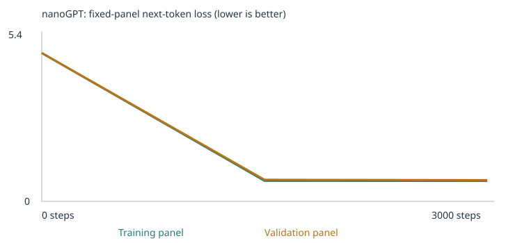

# My Custom LLM Experiment

Class 4, Fall 26 — From Zero to AI Agents. Trained Karpathy's nanoGPT transformer
from scratch on a synthetic classroom corpus, then on the same corpus extended
with new negation and spatial-relations material, and compared both against a
fixed 48-case language-eval suite before and after training.

Notebook: [custom_llm.ipynb](custom_llm.ipynb) ·
[Open in Colab](https://colab.research.google.com/github/kmatuska98/custom-llm/blob/main/custom_llm.ipynb) ·
[Assignment](ASSIGNMENT.md) · [3D embedding viewer](embedding-viewer.html)

> **Status:** starter-corpus experiment complete. Corpus-extension experiment and
> chat-interface evidence in progress — this README will be updated as those land.

## My choices and prediction

- **Corpus:** `classroom` (unmodified) for the first run — the teacher-authored
  synthetic sentences, to establish a baseline before extending it.
- **Training steps:** 3,000 — the assignment's suggested starting budget. One step
  updates weights on a batch of 32 passages, not a full pass over the corpus.
- **Learning rate:** 0.001 (AdamW, with warmup + cosine decay applied by the notebook).

Full reasoning for all three choices, plus the prediction written *before* training,
is in the notebook's "My prediction" cell:
[custom_llm.starter.executed.ipynb](custom_llm.starter.executed.ipynb) (cell 3) /
[custom_llm.py](custom_llm.py#L46-L82).

**Predicted:** sharp loss drop given how repetitive/formulaic the corpus is; the 16
`starter_patterns` eval cases (which test the corpus's own domain associations)
would improve the most; the 8 `starter_transfer` cases (same vocabulary, new
phrasings) would improve less; the 24 `extend_corpus` cases (grammar, opposites,
negation, reference, sequence, spatial relations, everyday knowledge,
categories/analogies) would barely move, since the classroom corpus contains none
of that vocabulary and more steps on the wrong data can't supply missing words.

## My run — starter corpus

- **Completed:** all 3,000/3,000 steps, no interruption, 54.9 seconds on CPU
  (`Linux ... torch 2.11.0+cpu`).
- **Model:** 111,872 parameters (2 blocks, 4 heads, 64-dim embeddings, 48-token
  context — [config.json](llm_runs/starter_run/config.json)).
- **Vocabulary:** 136 word/punctuation types, 0% unknown-token rate in both
  training and validation
  ([vocabulary_report.json](llm_runs/starter_run/vocabulary_report.json)).
- **Corpus:** 6,200 base passages → 4,592 unique after removing 1,608 duplicates
  → split into 4,132 training / 460 validation documents
  ([corpus_manifest.json](llm_runs/starter_run/corpus_manifest.json)). The split is
  by short passage, not by source file, so this validation set tests recall of the
  same sentence frames/domains, not generalization to unseen material.
- 160 classroom-generated passages containing one of the 16 `starter_patterns`
  eval prefixes were automatically withheld before the split
  ([eval_separation.json](llm_runs/starter_run/eval_separation.json)).

## My evidence



Fixed panels of 20 training / 20 validation documents, evaluated at 3 checkpoints
([history.json](llm_runs/starter_run/history.json)):

| Step | Training loss | Validation loss |
|---|---|---|
| 0 | 4.926 | 4.928 |
| 1,500 | 0.682 | 0.718 |
| 3,000 | 0.678 | 0.706 |

Both curves are monotonically decreasing — no dip-then-rise — but almost all of
the drop happens by step 1,500 (train loss falls ~4.24; validation ~4.21). The
remaining 1,500 steps buy only another 0.004 (train) / 0.012 (validation). **My
read:** the loss curve is approaching an asymptote by step 1,500, so for this
corpus, 3,000 steps is plenty — likely more budget than actually needed. I'd try
1,500 steps as a comparison in a future run before assuming more steps always helps.

Generated samples, same seed/settings throughout
([samples/](llm_runs/starter_run/samples/)):

- **Untrained (step 0):** `pear professor bond doctor course harvest team physician journey checking buyer delivery traffic report the lecturer item offering and system <UNK> taste recommended mentioned bus question customer at mortgage nurse in instructor` — no grammar, no structure.
- **Halfway (step 1,500):** `our school has a question about the new educator and lesson .` / `a review of risk helped us understand the different deposit .`
- **Final (step 3,000):** `the report about the nurse explains the health in detail .` / `the consumer compared the offering after checking the price .`

By step 1,500 the model already produces grammatical, on-domain sentences
matching the classroom's own templates; step 3,000 samples are similar quality,
consistent with the flat loss curve above.

### Token → ID → embedding, gradient, and one weight update

[tokenization.json](llm_runs/starter_run/tokenization.json) ·
[inspection.json](llm_runs/starter_run/inspection.json)

- Token **"customer"** → ID **28**. Its 64-number embedding shifted substantially
  during training (dimension 0: `-0.057592` → `0.036630`; not just noise — every
  dimension moved).
- First saved parameter update: gradient `0.000693`, learning rate `1e-5`
  (early in warmup), `before = -0.057592` → `after = -0.057602`. Weight update =
  `-learning_rate * gradient`, i.e. a tiny nudge in the direction that reduces loss.
- Next-token probabilities for the prefix **"the customer"**:
  - *Before training:* nearly uniform over 136 words (top guess "customer" itself
    at 1.6% — essentially random).
  - *After training:* sharply peaked on the classroom's own verb list for that
    template — `reviewed` (17.8%), `recommended` (17.1%), `ordered` (16.9%),
    `selected` (16.3%), `compared` (16.0%), `returned` (14.3%) — i.e. it learned
    the literal frame `"the {noun} {verb} the {product} after checking the price ."`

### Temperature comparison

[temperature_comparison.json](llm_runs/starter_run/temperature_comparison.json) —
same starting token and seed at temperature 0.3, 0.8, and 1.2. Output was nearly
identical across all three (only one word differed between 0.3 and the other two),
because the trained model's next-token distribution is already sharply peaked
(see the >60% combined mass on 6 words above) — temperature reweights the
distribution but can't manufacture uncertainty that isn't there. No weights change
when temperature changes; it only affects sampling at generation time.

## My fixed language evals

[evals/language_evals.json](evals/language_evals.json) (unchanged) ·
[run_evals.py](run_evals.py) ·
untrained: [eval_summary.json](llm_runs/starter_run/language_evals/untrained/eval_summary.json) /
[eval_results.csv](llm_runs/starter_run/language_evals/untrained/eval_results.csv) ·
final: [eval_summary.json](llm_runs/starter_run/language_evals/final/eval_summary.json) /
[eval_results.csv](llm_runs/starter_run/language_evals/final/eval_results.csv) ·
[full untrained-vs-final comparison](llm_runs/starter_run/language_eval_comparison.json)

| Experiment | Stage | Correct / 48 | Scorable / 48 | Accuracy among scorable | Full results |
|---|---|---|---|---|---|
| Starter corpus | Untrained | 9 | 24 | 37.5% | [untrained](llm_runs/starter_run/language_evals/untrained/) |
| Starter corpus | Trained | 20 | 24 | 83.3% | [final](llm_runs/starter_run/language_evals/final/) |
| Expanded corpus | Untrained | *(pending)* | | | |
| Expanded corpus | Trained | *(pending)* | | | |

By group:

| Group | Untrained | Trained |
|---|---|---|
| `starter_patterns` (16 cases) | 6/16 (37.5%) | **16/16 (100%)** |
| `starter_transfer` (8 cases) | 3/8 (37.5%) | 4/8 (50%) |
| `extend_corpus` (24 cases) | 0/24 | 0/24 |

`starter_patterns` improved exactly as predicted — these test the classroom's own
domain word-associations directly, and training got every single one right.
`starter_transfer` improved more modestly (applying the learned association to an
unseen sentence shape is harder than repeating a seen one).

`extend_corpus` is the most important honest result: it's not that the trained
model *guessed wrong* on those 24 cases — **coverage was 0.0% in every one of the
8 extension categories**, meaning every case contains at least one word (e.g.
"cold," "not," "above," "fish") that never appears anywhere in the classroom
vocabulary, so the model literally could not attempt them. This is a vocabulary
gap, not a reasoning failure — it shows the classroom corpus can't test grammar,
opposites, negation, reference, sequence, spatial relations, everyday knowledge,
or categories/analogies at all, motivating the corpus extension below. More
training steps on the same corpus could not have fixed this.

### Corpus-extension plan: `negation` and `spatial_relations`

[corpus_extension/README.md](corpus_extension/README.md) has the full rationale.
In short: the classroom corpus has zero words or patterns for either category, so
whatever the extended model does or doesn't learn should be attributable to the
new material, not a partially-covered skill. The two categories also contrast in
difficulty: `negation` requires suppressing a nearby mentioned word and following
a correction (harder for a 2-block/4-head model), while `spatial_relations` is
more directly associative (a relation and its inverse repeated together) — a
better test of whether a tiny model can learn *any* pattern beyond word
co-occurrence versus only the easier one.

New material: [negation.txt](corpus_extension/negation.txt) (2,150 lines, e.g.
`dana did not order the coffee . dana ordered the juice instead .`) and
[spatial_relations.txt](corpus_extension/spatial_relations.txt) (912 lines, e.g.
`the cup is above the shelf . the shelf is below the cup .`). Both were checked
against all 48 eval prompts for exact-text overlap before being written
([gen_extension_corpus.py](gen_extension_corpus.py)) — no eval prompt appears
verbatim in either file, and different names/items/sentence structures than the
eval's own negation and spatial-relations cases were used deliberately.

*(Results for this experiment — loss, samples, evals, vocabulary coverage — to be
added once the second run is complete.)*

## My chat interface

*(Pending — need 2 more real interactions beyond the 1 saved so far, plus a
screenshot/recording, using the final trained model.)*

Launch: notebook section 10 (same-notebook chat cell), or from the command line
after training:

```sh
python chat.py --model llm_runs/YOUR_RUN/model.pt --transcript results/my-chat.json
```

The interface is a tiny language model that continues a sentence from a fresh
48-token context each prompt (no conversation memory); unknown words become
`<UNK>`. It uses the actual trained nanoGPT (`model.pt`) — no external API.

## What I learned

*(To fill in with my own explanation, using the actual token/embedding/gradient/
loss evidence above, once both experiments are complete.)*

## One limitation and my next experiment

**Limitation observed so far:** the starter-corpus model cannot attempt (not just
answer poorly on) any of the 8 extension-eval categories — 0% vocabulary coverage
across all 24 `extend_corpus` cases.

**Next experiment:** the corpus-extension run above. A further follow-up worth
trying afterward: retrain the starter corpus alone with only 1,500 steps (half
the budget), since the loss curve suggests 3,000 steps added very little beyond
that point — worth confirming whether that holds once a larger, non-classroom
corpus is in the mix too.

## Reproduce and inspect

1. Open [custom_llm.ipynb](custom_llm.ipynb) in
   [Colab](https://colab.research.google.com/github/kmatuska98/custom-llm/blob/main/custom_llm.ipynb)
   (or locally with `pip install -r requirements.txt`) and Run All.
2. Fixed evals: `python run_evals.py --model llm_runs/YOUR_RUN/model.pt --output results/my-evals`
3. Chat: `python chat.py --model llm_runs/YOUR_RUN/model.pt`
4. Embedding viewer: open [embedding-viewer.html](embedding-viewer.html) locally
   and load [llm_runs/starter_run/checkpoint.json](llm_runs/starter_run/checkpoint.json).

All source code, the fixed eval suite, and both experiments' complete results are
kept in this repository (not cleared/gitignored) since the corpus is entirely
synthetic teaching material with no private or third-party content.
