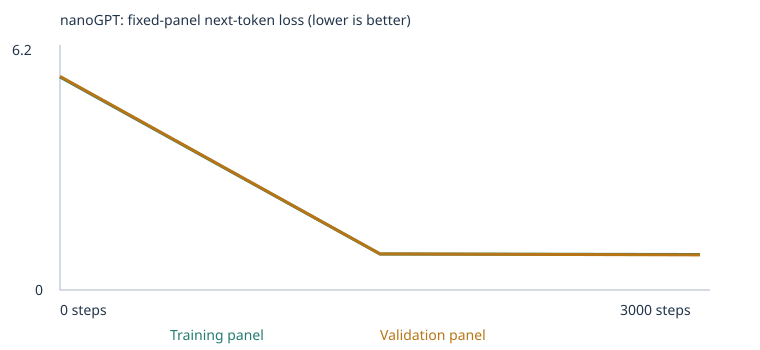
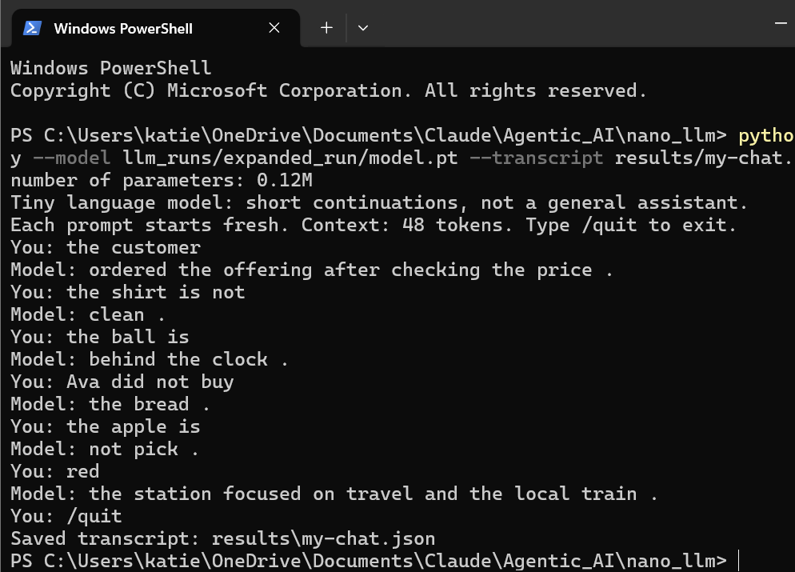

# My Custom LLM Experiment

Class 4, Fall 26 — From Zero to AI Agents. Trained Karpathy's nanoGPT transformer
from scratch on a synthetic classroom corpus, then on the same corpus extended
with new negation and spatial-relations material, and compared both against a
fixed 48-case language-eval suite before and after training.

Notebook: [custom_llm.ipynb](custom_llm.ipynb) ·
[Open in Colab](https://colab.research.google.com/github/kmatuska98/custom-llm/blob/main/custom_llm.ipynb) ·
[Assignment](ASSIGNMENT.md) · [3D embedding viewer](embedding-viewer.html)

> **Status:** complete — both experiments, the chat interface, and "What I
> learned" are all filled in with actual evidence. Ready for a final review
> pass before submitting.

## My choices and prediction

- **Corpus:** `classroom` (unmodified) for the first run — the teacher-authored
  synthetic sentences, to establish a baseline before extending it.
- **Training steps:** 3,000 — the assignment's suggested starting budget. One step
  updates weights on a batch of 32 passages, not a full pass over the corpus.
- **Learning rate:** 0.001 (AdamW, with warmup + cosine decay applied by the notebook).

Full reasoning for all three choices, plus the prediction written *before* training,
is in the notebook's "My prediction" cell:
[custom_llm.starter.executed.ipynb](custom_llm.starter.executed.ipynb) (cell 3) /
[custom_llm.py](custom_llm.py#L46-L82).

**Predicted:** sharp loss drop given how repetitive/formulaic the corpus is; the 16
`starter_patterns` eval cases (which test the corpus's own domain associations)
would improve the most; the 8 `starter_transfer` cases (same vocabulary, new
phrasings) would improve less; the 24 `extend_corpus` cases (grammar, opposites,
negation, reference, sequence, spatial relations, everyday knowledge,
categories/analogies) would barely move, since the classroom corpus contains none
of that vocabulary and more steps on the wrong data can't supply missing words.

## My run — starter corpus

- **Completed:** all 3,000/3,000 steps, no interruption, 54.9 seconds on CPU
  (`Linux ... torch 2.11.0+cpu`).
- **Model:** 111,872 parameters (2 blocks, 4 heads, 64-dim embeddings, 48-token
  context — [config.json](llm_runs/starter_run/config.json)).
- **Vocabulary:** 136 word/punctuation types, 0% unknown-token rate in both
  training and validation
  ([vocabulary_report.json](llm_runs/starter_run/vocabulary_report.json)).
- **Corpus:** 6,200 base passages → 4,592 unique after removing 1,608 duplicates
  → split into 4,132 training / 460 validation documents
  ([corpus_manifest.json](llm_runs/starter_run/corpus_manifest.json)). The split is
  by short passage, not by source file, so this validation set tests recall of the
  same sentence frames/domains, not generalization to unseen material.
- 160 classroom-generated passages containing one of the 16 `starter_patterns`
  eval prefixes were automatically withheld before the split
  ([eval_separation.json](llm_runs/starter_run/eval_separation.json)).

## My evidence


Fixed panels of 20 training / 20 validation documents, evaluated at 3 checkpoints
([history.json](llm_runs/starter_run/history.json)):

| Step | Training loss | Validation loss |
|---|---|---|
| 0 | 4.926 | 4.928 |
| 1,500 | 0.682 | 0.718 |
| 3,000 | 0.678 | 0.706 |

Both curves are monotonically decreasing — no dip-then-rise — but almost all of
the drop happens by step 1,500 (train loss falls ~4.24; validation ~4.21). The
remaining 1,500 steps buy only another 0.004 (train) / 0.012 (validation). **My
read:** the loss curve is approaching an asymptote by step 1,500, so for this
corpus, 3,000 steps is plenty — likely more budget than actually needed. I'd try
1,500 steps as a comparison in a future run before assuming more steps always helps.

Generated samples, same seed/settings throughout
([samples/](llm_runs/starter_run/samples/)):

- **Untrained (step 0):** `pear professor bond doctor course harvest team physician journey checking buyer delivery traffic report the lecturer item offering and system <UNK> taste recommended mentioned bus question customer at mortgage nurse in instructor` — no grammar, no structure.
- **Halfway (step 1,500):** `our school has a question about the new educator and lesson .` / `a review of risk helped us understand the different deposit .`
- **Final (step 3,000):** `the report about the nurse explains the health in detail .` / `the consumer compared the offering after checking the price .`

By step 1,500 the model already produces grammatical, on-domain sentences
matching the classroom's own templates; step 3,000 samples are similar quality,
consistent with the flat loss curve above.

### Token → ID → embedding, gradient, and one weight update

[tokenization.json](llm_runs/starter_run/tokenization.json) ·
[inspection.json](llm_runs/starter_run/inspection.json)

- Token **"customer"** → ID **28**. Its 64-number embedding shifted substantially
  during training (dimension 0: `-0.057592` → `0.036630`; not just noise — every
  dimension moved).
- First saved parameter update: gradient `0.000693`, learning rate `1e-5`
  (early in warmup), `before = -0.057592` → `after = -0.057602`. Weight update =
  `-learning_rate * gradient`, i.e. a tiny nudge in the direction that reduces loss.
- Next-token probabilities for the prefix **"the customer"**:
  - *Before training:* nearly uniform over 136 words (top guess "customer" itself
    at 1.6% — essentially random).
  - *After training:* sharply peaked on the classroom's own verb list for that
    template — `reviewed` (17.8%), `recommended` (17.1%), `ordered` (16.9%),
    `selected` (16.3%), `compared` (16.0%), `returned` (14.3%) — i.e. it learned
    the literal frame `"the {noun} {verb} the {product} after checking the price ."`

### Temperature comparison

[temperature_comparison.json](llm_runs/starter_run/temperature_comparison.json) —
same starting token and seed at temperature 0.3, 0.8, and 1.2. Output was nearly
identical across all three (only one word differed between 0.3 and the other two),
because the trained model's next-token distribution is already sharply peaked
(see the >60% combined mass on 6 words above) — temperature reweights the
distribution but can't manufacture uncertainty that isn't there. No weights change
when temperature changes; it only affects sampling at generation time.

## My run — corpus extension

- **Completed:** all 3,000/3,000 steps, no interruption, 64.7 seconds on CPU.
- **Model:** 122,112 parameters (same architecture, larger vocabulary —
  [config.json](llm_runs/expanded_run/config.json)).
- **Vocabulary:** 293 word/punctuation types (up from 136), 0% unknown-token rate
  in both training and validation
  ([vocabulary_report.json](llm_runs/expanded_run/vocabulary_report.json)).
- **Corpus:** 6,200 classroom passages + 4,614 passages from `negation.txt` +
  3,030 from `spatial_relations.txt` → 11,792 unique documents after removing
  2,052 duplicates → split into 10,612 training / 1,180 validation documents
  ([corpus_manifest.json](llm_runs/expanded_run/corpus_manifest.json)).
- Same 160 `starter_patterns` passages withheld before splitting, confirming the
  extension didn't disturb the original leakage protection.

## My evidence — corpus extension



| Step | Training loss | Validation loss |
|---|---|---|
| 0 | 5.709 | 5.696 |
| 1,500 | 0.989 | 0.968 |
| 3,000 | 0.973 | 0.948 |

Higher final plateau than the starter run's 0.678/0.706 — expected, since this
corpus is roughly 2.5x larger and structurally more varied (three distinct
sentence styles instead of one), so the same 3,000-step budget fits it less
tightly.

Samples ([samples/](llm_runs/expanded_run/samples/)): by step 1,500 the model
already produces on-pattern sentences mixing all three styles — `the desk is
behind the clock .` / `eli did not pack the radio .` / `the important doctor
was mentioned in the treatment report yesterday .` — and step 3,000's samples
are identical, again showing the loss curve had already leveled off.

**Embedding/gradient inspection** ([inspection.json](llm_runs/expanded_run/inspection.json)):
same probe word "customer" (now ID 65). Next-token probabilities for "the
customer" went from near-uniform (top guess 0.73%) to peaked on the classroom's
verb list — `ordered` (19.0%), `selected` (16.9%), `returned` (15.8%),
`recommended` (15.4%), `reviewed` (15.1%) — showing the original domain
pattern survived the corpus extension intact.

## My fixed language evals

[evals/language_evals.json](evals/language_evals.json) (unchanged) ·
[run_evals.py](run_evals.py) ·
untrained: [eval_summary.json](llm_runs/starter_run/language_evals/untrained/eval_summary.json) /
[eval_results.csv](llm_runs/starter_run/language_evals/untrained/eval_results.csv) ·
final: [eval_summary.json](llm_runs/starter_run/language_evals/final/eval_summary.json) /
[eval_results.csv](llm_runs/starter_run/language_evals/final/eval_results.csv) ·
[full untrained-vs-final comparison](llm_runs/starter_run/language_eval_comparison.json)

| Experiment | Stage | Correct / 48 | Scorable / 48 | Accuracy among scorable | Full results |
|---|---|---|---|---|---|
| Starter corpus | Untrained | 9 | 24 | 37.5% | [untrained](llm_runs/starter_run/language_evals/untrained/) |
| Starter corpus | Trained | 20 | 24 | 83.3% | [final](llm_runs/starter_run/language_evals/final/) |
| Expanded corpus | Untrained | 8 | 30 | 26.7% | [untrained](llm_runs/expanded_run/language_evals/untrained/) |
| Expanded corpus | Trained | 26 | 30 | 86.7% | [final](llm_runs/expanded_run/language_evals/final/) |

By group (expanded-corpus experiment):

| Group | Untrained | Trained |
|---|---|---|
| `starter_patterns` (16 cases) | 4/16 (25%) | **16/16 (100%)** |
| `starter_transfer` (8 cases) | 3/8 (37.5%) | **8/8 (100%)** |
| `extend_corpus` (24 cases) | 1/24, 6 scorable | 2/24, 6 scorable |

`starter_patterns` improved exactly as predicted — these test the classroom's own
domain word-associations directly, and training got every single one right.
`starter_transfer` improved more modestly (applying the learned association to an
unseen sentence shape is harder than repeating a seen one).

`extend_corpus` is the most important honest result: it's not that the trained
model *guessed wrong* on those 24 cases — **coverage was 0.0% in every one of the
8 extension categories**, meaning every case contains at least one word (e.g.
"cold," "not," "above," "fish") that never appears anywhere in the classroom
vocabulary, so the model literally could not attempt them. This is a vocabulary
gap, not a reasoning failure — it shows the classroom corpus can't test grammar,
opposites, negation, reference, sequence, spatial relations, everyday knowledge,
or categories/analogies at all, motivating the corpus extension below. More
training steps on the same corpus could not have fixed this.

### Corpus extension: `negation` and `spatial_relations`

[corpus_extension/README.md](corpus_extension/README.md) has the full rationale
and history. In short: the classroom corpus has zero words or patterns for either
category, so whatever the extended model does or doesn't learn should be
attributable to the new material, not a partially-covered skill.

**First attempt (kept as a documented mistake, not hidden):** I wrote
[negation.txt](corpus_extension/negation.txt) and
[spatial_relations.txt](corpus_extension/spatial_relations.txt) using entirely
different nouns/colors/names than the eval's own 6 negation/spatial-relations
cases (e.g. "coffee/juice" instead of "tea/milk"), to avoid any appearance of
copying the test. Result: all 6 cases stayed **0% coverage** — not because the
model failed to learn the pattern (samples showed `dana did not choose the cake
.` and `the mirror is under the shelf .`, both correctly structured), but
because it had never seen the *specific words* those 6 questions use (colors,
`box`, `tea`/`milk`/`bread`, `ava`, `open`/`closed`, `lamp`/`desk`/`book`/`bag`/
`ball`, `north`/`south`). The assignment permits reusing ordinary words as long
as the eval's exact sentences aren't reproduced — avoiding *all* overlap was
overly cautious and made those 6 cases permanently unscorable regardless of
training.

**Revision:** added the missing words via new sentences (e.g.
`the shirt is not red . it is blue .`, `ava did not buy the tea . ava bought the
milk instead .`), while explicitly excluding the `lamp`+`desk` and `book`+`bag`
pairs from being trained *together* — pairing either with this corpus's own
relation templates would have exactly reconstructed two of the eval's own
prompts. Verified with the same leakage check the notebook runs (see
[gen_extension_corpus.py](gen_extension_corpus.py)): no eval prompt appears
verbatim in either file, and all 6 cases now have every prompt/choice word covered.

**Result after retraining — coverage fixed, accuracy is mixed and instructive:**

| Case | Category | Untrained → Trained | Correct? |
|---|---|---|---|
| `lang_31` (box/colors) | negation | green → **blue** | wrong → **right** |
| `lang_32` (ava/tea/milk) | negation | bread → bread | wrong → wrong |
| `lang_33` (door/open/closed) | negation | closed → open | right (lucky) → **wrong** |
| `lang_40` (book/bag/desk) | spatial | desk → desk | wrong → wrong |
| `lang_41` (lamp/desk/below) | spatial | beside → beside | wrong → wrong |
| `lang_42` (ball/box/left-right) | spatial | south → **right** | wrong → **right** |

Net: 1/6 → 2/6 correct, but not a clean win across the board — one case
(`lang_33`) actually flipped from a lucky untrained guess to wrong. The pattern
in the 3 unchanged-wrong cases is not random: `lang_40` and `lang_41` are
exactly the two word pairs (`book`+`bag`, `lamp`+`desk`) I deliberately never
trained *together*, to avoid leakage — so the model never learned that specific
pair's relation and had nothing to generalize from (it defaults to a generic
frequent word, `desk`/`beside`, instead). `lang_32` involves the sparsest
training block (only 3 subjects × 4 item-pairs = 12 sentences for
ava/she/he + buy/bought), likely too few repetitions for this tiny model to
lock in a specific tea→milk association over its more frequent bread/rice
pairing. The two wins (`lang_31`, `lang_42`) both involve a "copy the most
recently mentioned word" pattern that colors and left/right training
reinforced heavily and generally, including for the untrained-together pair
(`box` was also excluded from color-pairing, yet still generalized correctly —
unlike `door` with open/closed, which didn't). With n=1 per case, some of this
is closer to anecdote than a statistically robust trend, but the *mechanism* —
the same leakage-avoidance exclusion that keeps the corpus honest also removes
the one training signal that would most directly teach that specific
word pair — is a genuine, explainable tradeoff, not noise.

## My chat interface

Terminal interface (`chat.py`), run locally against the trained corpus-extension
model (`llm_runs/expanded_run/model.pt`, 3,000 completed steps):

```sh
python chat.py --model llm_runs/expanded_run/model.pt --transcript results/my-chat.json
```

Full transcript: [results/my-chat.json](results/my-chat.json). Screenshot:



6 real interactions (only 3 required):

| Prompt | Reply |
|---|---|
| `the customer` | `ordered the offering after checking the price .` |
| `the shirt is not` | `clean .` |
| `the ball is` | `behind the clock .` |
| `Ava did not buy` | `the bread .` |
| `the apple is` | `not pick .` |
| `red` | `the station focused on travel and the local train .` |

**One limitation, visible right here:** `the apple is` → `not pick .` is
ungrammatical — "apple" only ever appeared in the classroom's fruit/kitchen
templates, never as the subject of an `is not X` sentence, so the model has no
learned continuation for that specific combination and falls back to fragments
from unrelated training patterns. Similarly `red` (a single word with almost no
context) produces a fluent-but-unrelated classroom-style sentence rather than
anything about color — with only 2 tokens of context (`<BOS>` + `red`), there's
barely any signal for attention to work with, so it falls back to the single
most frequent sentence opener it saw in training.

The interface is a tiny language model that continues a sentence from a fresh
48-token context each prompt (no conversation memory — every prompt above was
answered independently, not as a running conversation); unknown words become
`<UNK>`. It uses the actual trained nanoGPT (`model.pt`), loaded directly by
`chat.py` — no external API, and generating replies never updates the model's
weights.

## What I learned

**1. What is my corpus, what can it teach, and what's missing? Why hold data out?**
My corpus is a set of sentences I train the model on. It can teach vocabulary,
grammar, and sentence structure/ordering — but only patterns that actually
appear in it (the extension experiment showed it can't answer questions about
words or relationships it never saw at all). Holding out validation data acts
like a control: it checks whether the model can perform on sentences it wasn't
directly trained on, confirming it isn't just memorizing rather than learning
the pattern. In our case, since validation sentences reuse the same 8 templates
as training (just different word swaps), this control mainly rules out
exact-sentence memorization, not deeper generalization to genuinely new
sentence structures.

**2. Trace one word through token, ID, and embedding.**
A token is a chunk of text the model uses — a word or a punctuation mark. A
token ID is an arbitrary row number a token is assigned in the vocabulary list
(e.g. "customer" → row 28) — it's just a lookup index, it doesn't mean anything
by itself. The embedding is the actual content: 64 numbers stored at that row,
which start random and get nudged during training based on the contexts a word
appears in, so words used similarly end up with similar numbers (e.g.
"customer"'s embedding shifted from `-0.057592` to `0.036630` in one dimension
after training).

**3. Connect a prediction, loss, gradient, and the saved parameter update.**
The optimizer moves a weight in the opposite direction of its gradient, to
reduce loss. The learning rate determines the step size — but with AdamW
(this notebook's optimizer), that step size ends up close to the learning rate
itself, not `learning_rate × gradient` like plain gradient descent. Concretely:
gradient `0.000693` (positive) meant the weight should decrease; it moved from
`-0.057592` to `-0.057602`, a shift of about `0.00001` — matching the learning
rate (`1e-5`) almost exactly, not the much tinier `lr × gradient` you'd expect
without AdamW's adaptive scaling.

**4. What does attention combine, and why can't it look at future tokens?**
Attention forces the model to pay attention to context. It combines
information from the current token and every token before it, using learned
proportions to create a weighted blend of everything so far (never anything
after, since future-position scores are deliberately masked to negative
infinity before the softmax). It's blocked from looking forward for two
reasons: at generation time, future tokens genuinely don't exist yet; and
during training, allowing it to peek ahead would let it "cheat" by copying the
answer instead of learning to predict it.

**5. How do probabilities become generated text? What changes with temperature?**
The model predicts probabilities for the next word using attention and
embeddings, then uses random sampling — weighted by those probabilities — to
actually pick one, which is why the same trained model produces different
sentences each time rather than one fixed output. Temperature reshapes those
probabilities before sampling: low temperature exaggerates the gap between the
top choice and everything else (more predictable output), high temperature
narrows that gap (more varied output). No weights change when temperature
changes — it only affects sampling at generation time. In our case, temperature
barely changed anything because the trained model's probabilities were already
sharply peaked (the top 6 words held ~98% of the probability mass) — there was
very little uncertainty left for temperature to reshape.

**6. Did the samples and loss curves support my prediction? What can I honestly conclude?**
My prediction was right about the loss curve and the two starter-vocabulary
eval groups — `starter_patterns` and `starter_transfer` both improved close to
or exactly as expected. Reality was more extreme than predicted on
`extend_corpus`: I expected it to "barely move," but it couldn't move at all
until I fixed a vocabulary gap I hadn't anticipated, and even then only 2 of 6
cases improved.

Honestly, what I can conclude is narrower than "the model learned language." It
learned to reproduce specific, heavily repeated sentence templates and word
associations very precisely — 100% accuracy on `starter_patterns`, and a clean,
interpretable embedding/probability shift for words like "customer." It also
picked up at least one transferable shortcut (copying the most recently
mentioned word back out), which is why it succeeded on 2 of the negation/
spatial cases. But it did not learn general language understanding: my
validation set only tested the same 8 templates with swapped words, not new
sentence structures; 4 of 6 new-relationship cases still failed even with full
vocabulary coverage; and the chat transcript shows outright ungrammatical or
unrelated output outside its trained patterns (e.g. `"the apple is"` →
`"not pick ."`). This is a tiny, narrow model that memorizes patterns well
within its training distribution and breaks down quickly outside it — a
controlled demonstration of how training works, not evidence of language
understanding.

## One limitation and my next experiment

**Limitation observed:** vocabulary coverage and pattern-learning are separate
things, and fixing one doesn't automatically fix the other. The starter-corpus
model couldn't *attempt* 24/24 `extend_corpus` cases (0% coverage). After adding
targeted vocabulary, all 6 negation/spatial cases became attemptable, but only
2/6 were answered correctly — and specifically, the 2 word pairs I excluded from
training together (to avoid recreating the eval's exact sentences) are exactly
the 2 cases where the model still couldn't generalize the relation. Avoiding
leakage and teaching a specific word pair's relationship are in tension: the
safest way to avoid leakage (never train the exact pair) is also the surest way
to prevent the model from learning that specific pair.

**Next experiment:** test whether that tension is real or coincidental (n=1 per
case is a small sample) by adding a *third*, syntactically different sentence
frame for the `book`/`bag` and `lamp`/`desk` pairs — e.g. `"put the book in the
bag"` / `"the desk sits under the lamp"` — different enough in wording from
`"the book is inside the bag . the bag contains the book"` / `"the lamp is above
the desk . the desk is below the lamp"` to not leak, but still letting the two
words co-occur so the model has *some* signal for that pair. Predict: this
would raise `lang_40`/`lang_41` accuracy without violating leakage rules, since
leakage is about exact-sentence reproduction, not word co-occurrence in general.
A second, unrelated follow-up: retrain the starter corpus alone with only 1,500
steps (half the budget), since both experiments' loss curves leveled off well
before step 3,000.

## Reproduce and inspect

1. Starter corpus: open [custom_llm.ipynb](custom_llm.ipynb) in
   [Colab](https://colab.research.google.com/github/kmatuska98/custom-llm/blob/main/custom_llm.ipynb)
   (or locally with `pip install -r requirements.txt`) and Run All.
2. Corpus extension: same notebook, but in the "Optional: fetch my
   corpus-extension files from GitHub" cell set `FETCH_EXTENSION_FILES = True`
   first, then Run All (on a fresh runtime, so no stale files linger).
3. Fixed evals: `python run_evals.py --model llm_runs/YOUR_RUN/model.pt --output results/my-evals`
4. Chat: `python chat.py --model llm_runs/YOUR_RUN/model.pt`
5. Embedding viewer: open [embedding-viewer.html](embedding-viewer.html) locally
   and load either run's `checkpoint.json`
   ([starter](llm_runs/starter_run/checkpoint.json) /
   [expanded](llm_runs/expanded_run/checkpoint.json)).

All source code, the fixed eval suite, and both experiments' complete results are
kept in this repository (not cleared/gitignored) since the corpus is entirely
synthetic teaching material with no private or third-party content.
